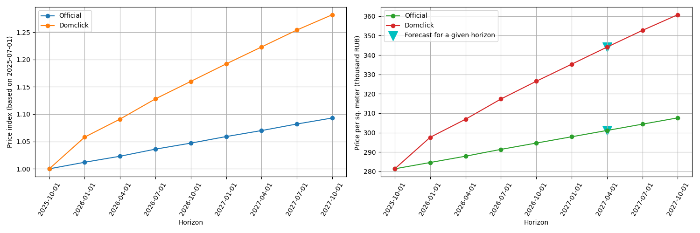

# Apartment price and demand forecast
Набор Python-скриптов для оценки квартир в Москве с учётом долгосрочной (до 2 лет) перспективы.
Back-end для Интеллектуальной системы мониторинга и рекомендаций по формированию стоимости квартир в домах, 
построенных в рамках реализации Программы реновации.
(Упрощенный вариант 2.3)

## 1. Комплект поставки.
<B>M_Price_2_4.py</B> - прогнозирование/эксплуатация с запросом API обновлённая версия. Изменения касаются формата вывода результатов. Дальнейшее описание соответсвует этой версии. 
(M_Price_2_3.py</B> - прогнозирование/эксплуатация с запросом API обновлённая версия. Изменения касаются формата вывода результатов. Дальнейшее описание соответсвует этой версии.) 
(M_Price_2_2.py - прогнозирование/эксплуатация с запросом API старый вариант) 
start.ipynb - образец формирования и выполнения запроса. 
<B>/src:</B> 
reservoir_model.py - процедуры для прогнозирования индекса цен на горизонт до 105 недель.  
GBoost_model.pkl - сохранённые веса моделей (в архиве не все, недостающие появятся после обучения моделей)*  
Сохраненая модель может не запуститься на некоторых процесорах. В таком случае следует обучить и сохранить её на той технике, на которой предстоит использовать. 
Для этого в папке /M_train есть обучающий набор данных /M_train/train_df.csv и процедура обучения с сохранением /M_train/model_train.ipynb
Полученный GBoost_model.pkl следует поместить в /src.
 
<B>/results</B> - папка для сохранения результатов 
<B>Справочники /data</B> 
	data_run.xlsx – сырые данные о сделках для прогноза (фрагмент исходных данных по сделкам 1686 шт.)  
	dom_index.csv – индекс московской недвижимости Домклик** для коррекции результата (обновляется автоматически раз в неделю) 
	edu.csv – координаты образовательных учреждений 
	enterprises.csv – координаты промышленных объектов 
	med.csv – координаты медицинских учреждений 
	metro.csv – координаты станций метрополитена 
	price_ind.csv – индекс цен по Росстату для подготовки обучающих данных 
	railway.csv – координаты железнодорожных станций 
 	cem.csv – координаты кладбищ 
  	inflatio.csv - инфляция по отрасли "Жилищное строительство" в соответствии с <A href='https://www.mos.ru/depr/documents/normativno-pravovye-akty-departamenta/view/315700220/'>
   Распоряженем Департамента экономической политики и развития города Москвы № ДПР-Р-34/24 28.12.2024</A>
        "Об утверждении прогнозных коэффициентов инфляции на 2025–2027 годы (с фактическими коэффициентами инфляции за период с 2023 по 2024 годы (по состоянию на 20.12.2024))"  
  
 Для расчёта спроса на разные типы квартир: 
 	d_amr.csv - исторически данные с полями: Дата регистрации, Площадь квартиры, Район 
  	distr_coord - географические координаты (десятичные) центроидов районов Москвы
  ______________
*) Обновлена по сравнению с прежней версией от M_Price.py, с прежней не совместима. 
**) https://www.moex.com/ru/index/MREDC/archive?from=2025-01-26&till=2025-02-26&sort=TRADEDATE&order=desc

## 2. Импорты - зависимости.
	Python.3.10
		time
		pickle
		warnings
		json
	pandas 2.2.3
	numpy >1.19.5
	sklearn 1.5.2
 	flask 3.1.0

Кроме того используются: 
reservoir_model - самодельный модуль резервуарной нейронной сети для прогнозирования индекса цен при учёте инфляции в долгосрочном прогнозе. 
pymssa - библиотека многомерного сингулярного спектрального анализа для прогноза доли квартир различных типов в общем количестве продаваемых квартир. Заимствована у <A href='https://github.com/kieferk/pymssa'>kieferk</A>, там чистый Python, достаточно скопировать папку /pymssa в /src.

## 3. Входные данные.
Входные данные для прогноза стоимости передаются в запросе следующим образом:
https://127.0.0.1:5000/price?horizon=2&planchers_tot=56&height=179.9&souterrain=2&planchers_sur=54&n_app=450&superficie_tot=38910&espace_de_vie=22301.0&lon=37.398552745&lat=55.830326602
где 
	
 	{
	'planchers_tot':56, # общее количество этажей
	'height':179.9, # высота объекта (м)
	'souterrain':2, # количество подземных этажей
	'planchers_sur':54, # количество надземных этажей
	'n_app':450, # количество квартир
	'superficie_tot':38910, # общая площадь объекта 
	'espace_de_vie':22301.0, # жилая площадь объекта
	'lon':37.398552745, # долгота 
	'lat':55.830326602 # широта
 	}

Для определения предпочтений по типам: 
http://127.0.0.1:5000/demand?lon=37.65596415&lat=55.625664549999996&year=2026&month=7
где 

	{
	'lon':lat, # долгота 
	'lat':lon, # широта 
	'year':2026, # прогнозируемый год
	'month':7, # прогнозируемый месяц
	}

## 4. Запрос API.

Пример кода для формирования запроса про цену кв. метра: 
<pre>
<code class="language-python">
	from urllib.parse import urlencode
	param={
    	'planchers_tot':56, # общее количество этажей
    	'height':179.9, # высота объекта (м)
    	'souterrain':2, # количество подземных этажей
    	'planchers_sur':54, # количество надземных этажей
    	'n_app':450, # количество квартир
    	'superficie_tot':38910, # общая площадь объекта 
   		'espace_de_vie':22301.0, # жилая площадь объекта
    	'lon':37.398552745, # долгота
    	'lat':55.830326602 # широта
	}
	url = 'https://127.0.0.1:5000/price?'+urlencode(param)
 </code>
</pre>

http://127.0.0.1:5000/price?planchers_tot=56&height=179.9&souterrain=2&planchers_sur=54&n_app=450&superficie_tot=38910&espace_de_vie=22301.0&lon=37.61191755&lat=55.7965029  

Пример кода для формирования запроса про приоритеты:  
<pre>
<code class="language-python">
	from urllib.parse import urlencode
	lon, lat = 37.592144149999996, 55.750886550000004
	param={
    		'lon':lon, # долгота 
   		 	'lat':lat, # широта 
    		'year':2026, # прогнозируемый год
   		 	'month':7, # прогнозируемый месяц
		}
	url= 'http://127.0.0.1:5000/demand?'+urlencode(param)
</code>
</pre>

http://127.0.0.1:5000/demand?lon=37.592144149999996&lat=55.750886550000004&year=2026&month=7  

Образец выполнения в прилагаемом файле <A href='https://github.com/Anthony-Cov/Mos_real_estate/blob/main/start_2_4.ipynb'>start.ipynb</A>.  

## 5. Ответ API.
<B>Для прогноза цены:</B> 
<pre>
{
  "code": 0,
  "csv_name": "results/prognose_2025-09-15_08-33-43.csv",
  "dates": [
    "2025-09-01",
    "2025-12-01",
    "2026-03-01",
    "2026-06-01",
    "2026-09-01",
    "2026-12-01",
    "2027-03-01",
    "2027-06-01",
    "2027-09-01"
  ],
  "excel_name": "results/prognose_2025-09-15_08-33-43.xlsx",
  "forecast_horizon": [
    0.0,
    0.25,
    0.5,
    0.75,
    1.0,
    1.25,
    1.5,
    1.75,
    2.0
  ],
  "lat": 55.7965029,
  "lon": 37.61191755,
  "official": [
    1.0,
    1.014,
    1.025,
    1.037,
    1.048,
    1.06,
    1.071,
    1.083,
    1.096
  ],
  "price_index": [
    1.0,
    1.013,
    1.028,
    1.046,
    1.066,
    1.087,
    1.109,
    1.132,
    1.154
  ],
  "pricemetr_dom": [
    446.96,
    452.91,
    459.46,
    467.56,
    476.33,
    485.71,
    495.59,
    505.84,
    515.62
  ],
  "pricemetr_off": [
    446.88,
    453.35,
    458.1,
    463.28,
    468.45,
    473.63,
    478.8,
    483.98,
    489.59
  ],
  "pricemetr_today": 446.88354775828464,
  "response": "Okay"
}
 </pre>
Код завершения: 
<UL>
	<LI>0 - всё в порядке</LI>
 	<LI>-1 - Неверно задан горизонт прогноза. Значение должно быть одно из [0., 0.25, 0.5, 0.75, 1.0, 1.25, 1.5,1.75, 2.0]. В остальных случаях заменяется нулём.</LI>
 	<LI>-2 - Сомнение в соответстви данных о количестве этажей и высоте здания</LI>
 	<LI>-3 - Нет данных для прогнозирования индекса. Индекс принимается равным единице</LI>
 	<LI>-4 - Прогноз индекса сомнителен (больше 3 или меньше 1), но результат всё равно выдан и учетом этого индекса </LI>
</UL>	
 
Результат сохраняется в Excel и .csv файлs с именем, идентифицируемым по дате и времени в папке results/ . 
<pre>
_________________________________________________________________________________________________________________________________________________________________________________________
|Горизонт	|Дата		|Широта		|Долгота	|количество  	|общая площадь 	|жилая площадь	|Индекс 		|Индекс 	|Цена за метр	|Цена за метр	|Цена за метр 	|Примечание	|
|прогноза	|			|			|			|этажей всего 	|объекта		|объекта		|официальный	|Домклик	|на текущую дату|по Домклик 	|по официальной	|			|
------------+-----------+-----------+-----------+---------------+---------------+---------------+---------------+-----------+---------------+---------------+---------------+------------
|	0.0		|2025-09-01	|55.7965029	|37.61191755|56				|38910.0		|22301.0		|1.0  			|1.0		|446.88			|446.88			|446.88			|Okay		|
|	0.25	|2025-12-01	|55.7965029	|37.61191755|56				|38910.0		|22301.0		|1.014 			|1.013		|446.88			|452.91			|453.35			|Okay		|
|	0.5		|2026-03-01	|55.7965029	|37.61191755|56				|38910.0		|22301.0		|1.025			|1.028		|446.88			|459.46			|458.1			|Okay		|
|	0.75	|2026-06-01	|55.7965029	|37.61191755|56				|38910.0		|22301.0		|1.037 			|1.046		|446.88			|467.56			|463.28			|Okay		|
|	1.0		|2026-09-01	|55.7965029	|37.61191755|56				|38910.0		|22301.0		|1.048 			|1.066		|446.88			|476.33			|468.45			|Okay		|
|	1.25	|2026-12-01	|55.7965029	|37.61191755|56				|38910.0		|22301.0		|1.06  			|1.087		|446.88			|485.71			|473.63			|Okay		|
|	1.5		|2027-03-01	|55.7965029	|37.61191755|56				|38910.0		|22301.0		|1.071 			|1.109		|446.88 		|495.59			|478.8			|Okay		|
|	1.75	|2027-06-01	|55.7965029	|37.61191755|56				|38910.0		|22301.0		|1.083 			|1.132		|446.88			|505.84			|483.98			|Okay		|
|	2.0		|2027-09-01	|55.7965029	|37.61191755|56				|38910.0		|22301.0		|1.096 			|1.154		|446.88 		|515.62			|489.59			|Okay		|
------------+-----------+-----------+-----------+---------------+---------------+---------------+---------------+-----------+---------------+---------------+---------------+------------
</pre>
График динамики индексов и цены

<B>Для прогноза приоритетов:</B>
<pre>
	 {'1': 0.47, # Доля однокомнатных
	 '2': 0.25,  # Доля двухкомнатных
	 '3': 0.2,  # Доля трёхкомнатных
	 '4': 0.09, # Доля четырёхкомнатных
	 'code': 0,
	 'date': '2026-07-01',
	 'district': 'Марьина Роща',
	 'response': 'Okay'}
</pre>
Код завершения: 
<UL>
	<LI>0 - всё в порядке</LIL>
 	<LI>-1 - мало данных по району.</LI>
 	<LI>-2 - неизвестный район (в практике не встречается)</LI>
</UL>
  
